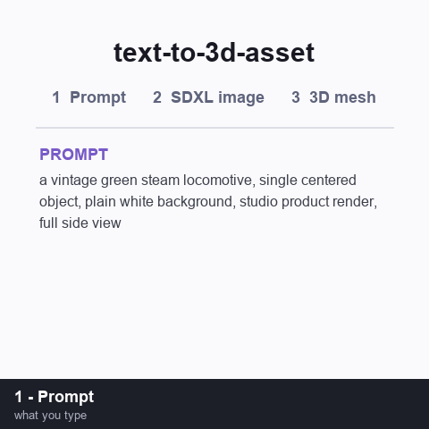

# text-to-3d-asset

A [Claude Code](https://claude.com/claude-code) **skill** that turns a text prompt or a photo into a
**game-ready, textured 3D asset** by orchestrating local AI services in sequence — then (optionally)
imports it straight into an Unreal Engine project.

```
prompt ──▶ Fooocus (SDXL)  ──▶  image.png
image  ──▶ Hunyuan3D-2      ──▶  textured .glb
.glb   ──▶ Blender          ──▶  .fbx
.fbx   ──▶ Unreal (MCP)     ──▶  StaticMesh / BP racer
```

It was built and validated end-to-end on a single Windows workstation (RTX 4070 Laptop, 8 GB VRAM /
32 GB RAM), generating engines for an Unreal train‑racer game.

## Example

A real run of the pipeline — the prompt below became an SDXL image (Fooocus), then a textured `.glb`
(Hunyuan3D‑2), shown here as a turntable of the generated mesh:



> Prompt: *"a vintage green steam locomotive, single centered object, plain white background,
> studio product render, full side view"* — every frame after the title card is an actual output of
> this skill (image from Fooocus, 3D turntable rendered from the Hunyuan3D‑2 `.glb`).

## What it does

| Stage | Tool | Output |
|-------|------|--------|
| 1. Text → image *(optional)* | [Fooocus](https://github.com/lllyasviel/Fooocus) SDXL, driven headlessly via the [Fooocus-API](https://github.com/mrhan1993/Fooocus-API) REST wrapper | `.png` |
| 2. Image → 3D | [Hunyuan3D‑2](https://github.com/Tencent-Hunyuan/Hunyuan3D-2) (image‑to‑textured‑mesh) | textured `.glb` |
| 3. Convert | [Blender](https://www.blender.org/) headless (`glTF → FBX`, embedded textures) | `.fbx` |
| 4. Import *(optional)* | Unreal Engine via the `unreal-mcp` server | StaticMesh + Blueprint |

If you already have a photo, skip Stage 1 and start at Stage 2.

## Contents

```
SKILL.md                 # the skill instructions Claude Code loads
scripts/fooocus_gen.py   # text → image via the Fooocus-API REST endpoint
scripts/hunyuan_gen.py   # image → textured GLB via the Hunyuan3D-2 gradio API
scripts/glb_to_fbx.py    # GLB → FBX (embedded textures) via headless Blender
```

## Requirements

- **Windows** with an **NVIDIA GPU (8 GB VRAM works; more is better)** and recent drivers.
- [Hunyuan3D‑2](https://github.com/Tencent-Hunyuan/Hunyuan3D-2) running locally (this skill was set up
  with the [WinPortable build](https://github.com/YanWenKun/Hunyuan3D-2-WinPortable)); its texture
  extensions (`custom_rasterizer`, `differentiable_renderer`) compiled against a CUDA toolkit matching
  its PyTorch build.
- [Fooocus](https://github.com/lllyasviel/Fooocus) + the [Fooocus-API](https://github.com/mrhan1993/Fooocus-API)
  wrapper (only needed for Stage 1 text‑to‑image).
- [Blender 4.x](https://www.blender.org/) (only for Stage 3 FBX conversion).
- An Unreal project with the `unreal-mcp` server (only for Stage 4 import).

## Install as a Claude Code skill

Copy this folder into a `.claude/skills/` directory so Claude Code discovers it:

```bash
# project-scoped (active in one project)
cp -r text-to-3d-asset  <your-project>/.claude/skills/text-to-3d-asset

# or user-scoped (active everywhere)
cp -r text-to-3d-asset  ~/.claude/skills/text-to-3d-asset
```

Then just ask, e.g. *"make me a 3D asset of a red double‑decker bus"* and the skill takes over.

## ⚠️ Important: one service at a time (8 GB GPUs)

Fooocus (SDXL) and Hunyuan3D each want most of an 8 GB card. Keeping **both loaded** exhausts VRAM +
RAM and swaps to disk — a generation that takes ~1 min balloons to ~14 min. The skill therefore
**stops the other server before generating**: stop Hunyuan (`:8080`) before Stage 1, stop Fooocus‑API
(`:8888`) before Stage 2. Relaunching is cheap by comparison.

## Note on paths

`SKILL.md` and the scripts contain **absolute paths specific to the machine they were built on**
(`C:\AI\...`, `C:\projects\...`). Adjust them to your own install locations before use.

## Credits

Built with [Claude Code](https://claude.com/claude-code). Wraps the excellent open‑source projects
linked above — all credit to their authors.
